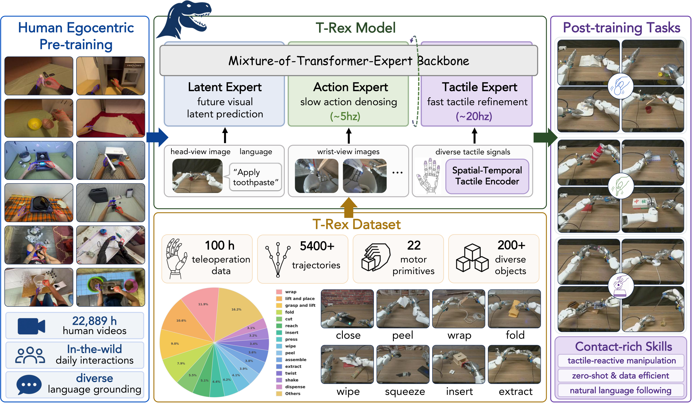

<div align="center">

# 🦖T-Rex: Tactile-Reactive Dexterous Manipulation


[🌐 **Project Page**](https://tactile-rex.github.io/) | [✍️ **Paper (arXiv)**](TODO) | [🎥 **Demo**](TODO)

Dantong Niu<sup>1,2*</sup>, Zhuoyang Liu<sup>1*</sup>, Zekai Wang<sup>1*</sup>, Boning Shao<sup>1</sup>, Zhao-Heng Yin<sup>1</sup>, Anirudh Pai<sup>1</sup>, Yuvan Sharma<sup>1</sup>, Stefano Saravalle<sup>4</sup>, Ruijie Zheng<sup>2</sup>, Jing Wang<sup>2</sup>, Ryan Punamiya<sup>2</sup>, Mengda Xu<sup>2</sup>, Yuqi Xie<sup>2</sup>, Yunfan Jiang<sup>2,3</sup>, Letian Fu<sup>1</sup>, Konstantinos Kallidromitis<sup>4</sup>, Matteo Gioia<sup>4</sup>, Junyi Zhang<sup>1</sup>, Jiaxin Ge<sup>1</sup>, Haiwen Feng<sup>1</sup>, Fabio Galasso, Wei Zhan<sup>1</sup>, David M. Chan<sup>1</sup>, Yutong Bai<sup>1</sup>, Roei Herzig<sup>1</sup>, Jiahui Lei<sup>1</sup>, Fei-Fei Li<sup>3</sup>, Ken Goldberg<sup>1</sup>, Jitendra Malik<sup>1</sup>, Pieter Abbeel<sup>1</sup>, Yuke Zhu<sup>2</sup>, Danfei Xu<sup>2</sup>, Jim (Linxi) Fan<sup>2‡</sup>, Trevor Darrell<sup>1‡</sup>

<sup>1</sup>UC Berkeley &nbsp;&nbsp; <sup>2</sup>NVIDIA &nbsp;&nbsp; <sup>3</sup>Stanford &nbsp;&nbsp; <sup>4</sup>Panasonic

<sup>*</sup>Equal Contribution &nbsp;&nbsp; <sup>‡</sup>Equal Advising

</div>

<p align="center">
  
</p>

**T-Rex pushes the frontier of *tactile-reactive* dexterous manipulation** —
reacting dynamically to high-frequency touch, which contemporary VLAs typically
overlook or capture only with static tactile encoders.

> **Abstract.** The ability to react dynamically to tactile signals has long been
> considered crucial to agile human-level dexterity. Yet contemporary
> learning-based VLAs for robotic manipulation generally either overlook the
> tactile modality or are limited to encoders with static cues — in part due to
> the scarcity of diverse training data and standardized evaluation, architectural
> constraints in current Vision-Language-Action (VLA) models, and limitations of
> static tactile encoders. In this paper, we push the frontier of tactile-reactive
> manipulation, addressing all of these limitations. We open-source a large-scale,
> 100-hour tactile-rich dataset collected via a novel, data-efficient recipe that
> prioritizes elementary motor primitives. To effectively exploit naturally
> high-frequency touch signals without sacrificing the existing capabilities of
> existing VLAs, we introduce a variable-rate Mixture-of-Transformer (MoT)
> architecture equipped with a novel temporal tactile VQ-VAE encoder. We
> demonstrate the effectiveness of tactile-reactive policies on 12 manipulation
> tasks requiring delicate force control and deformable object manipulation,
> achieving over 30% higher average success rate than the strongest baseline.

### Highlights

- **100-hour tactile-rich dataset**, collected with a data-efficient recipe that
  prioritizes elementary motor primitives (22 primitives, 200+ objects, 5400+
  trajectories) — open-sourced in [LeRobot v3.0](#lerobot-v30-data-path-opt-in) format.
- **Asynchronous Mixture-of-Transformers (MoT)** on a Qwen3-VL-2B backbone:
  *latent* (reason), *action*, and *tactile* experts running at different rates —
  slow action denoising (~5 Hz) and fast tactile refinement (~20 Hz) — coupled by
  **cascaded flow matching** so the policy reacts to contact *within* an action
  chunk without re-running the vision stack.
- **Temporal tactile VQ-VAE** that tokenizes high-frequency force/deformation over
  time; embedded in the model and encoded on the fly (no offline code baking).
- **> 30% higher average success** than the strongest baseline across 12
  contact-rich tasks (delicate force control, deformable-object manipulation).

Training runs in three stages: large-scale tactile-free **pretrain** →
tactile-reactive **midtrain** → task-specific **post-train**.

## 🤗 Model Zoo

Pretrained and midtrained checkpoints are released on the Hugging Face Hub:

| Checkpoint | Stage | Notes |
|---|---|---|
| [`miniFranka/T-Rex_pretrain_mecka22k_epoch1`](https://huggingface.co/miniFranka/T-Rex_pretrain_mecka22k_epoch1) | Pretrain | VLM-action alignment on ~22k tactile-free episodes (1 epoch); action + latent experts. Resume from this for midtrain. |
| [`miniFranka/T-Rex_midtrain_mecka23k_ucb100_vqvae_epoch6`](https://huggingface.co/miniFranka/T-Rex_midtrain_mecka23k_ucb100_vqvae_epoch6) | Midtrain | Tactile-reactive (cascaded flow + embedded VQ-VAE), 6 epochs. **Start here to fine-tune on your own task** (set as `RESUME_CHECKPOINT` for `scripts/train.sh`). |

The midtrain checkpoint embeds the tactile VQ-VAE, so post-train auto-detects it
(no separate `VQVAE_CKPT` needed) and encodes tactile codes on the fly.

## Repository layout

```
T-Rex/
├── qwen_vla/                       three-expert MoT model + VLA wrapper
│   ├── modeling_qwen3vl_mot.py     Qwen3VLAttentionMoT, decoder layer, MoT model
│   ├── modeling_vla.py             Qwen3VLVLAModel: ViT + MoT + embedders +
│   │                               forward_flow_action_{full,partial},
│   │                               tactile_flow_continue, tactile_flow_train_step
│   └── lerobot_dataset.py          LeRobot v3.0 dataloader (TRexLeRobotDataset)
├── diffusion/                      ActionEmbedder, TimestepEmbedder, FinalLayer
├── models/DeformAE.py              DeformEncoder for tactile-deformation images
├── tactile_vqvae/                  Discrete tactile codebook (separate trainer)
├── scripts/                        Three training stages + ZMQ inference server
│   ├── pretrain.sh   + pretrain.py    stage 1 (pretrain)
│   ├── midtrain.sh   + midtrain.py    stage 2 (midtrain)
│   ├── train.sh      + train.py       stage 3 (post-train SFT)
│   ├── test.sh       + test.py        ZMQ inference server
│   └── prepare_midtrain_merged.py     canonicalises raw episode dirs into the
│                                      midtrain layout (idempotent symlinks)
├── utils/                          data prep + checkpoint tooling
│   ├── gen_json_tac_deltabase_eef_bimanual_parallel.py + gen_json_bimanual.sh
│   │                                  raw → training JSON (eef-62)
│   ├── convert_inlab_to_lerobot.py / convert_egodex_to_lerobot.py (+ .sh)
│   │                                  raw → LeRobot v3.0 (eef-62)
│   ├── lerobot_common.py             shared schema + pose math + norm stats
│   ├── encode_vqvae_codes_to_json.py (+ .sh)   optional code pre-baker
│   ├── merge_vqvae_into_ckpt.py      (+ .sh)   bake VQ-VAE into a checkpoint
│   └── analyze_episode.py            per-episode visualization
├── config/sft_qwen.yaml            accelerate + DeepSpeed config
└── pyproject.toml                  pinned dependencies
```

## Install

```bash
conda create -n trex python=3.10 -y
conda activate trex
# torch first, from the CUDA-12.4 index:
pip install torch==2.6.0 torchvision==0.21.0 --index-url https://download.pytorch.org/whl/cu124
# everything else (pinned in pyproject.toml; transformers>=4.57 for Qwen3-VL):
pip install -e .
# optional — only if you train/convert with the LeRobot v3.0 data path:
pip install -e /path/to/lerobot
```

Each `.sh` has an **editable header** at the top — set `PROJECT_ROOT`, the conda
env path, and the data/checkpoint paths there for your machine (the scripts add
`PROJECT_ROOT` to `PYTHONPATH` themselves). There is no need to export anything
globally.

## Training pipeline

Three sequential stages, each resuming from the previous stage's
`checkpoint-{epoch}-{step}/` directory via `--resume_checkpoint`. Edit the path
variables at the top of each `.sh`, then run it.

| Stage | Script | Key vars to set (top of script) | What it does |
|---|---|---|---|
| **1.Pretrain** | `scripts/pretrain.sh` | `DATA_ROOT`, `ORIGIN_MODEL_PATH`, `OUTPUT_DIR` | VLM-action alignment on a large tactile-free corpus. Action expert is copy-initialised from the latent expert and trained on the full flow range; FLARE on; tactile expert unused. |
| **2.Midtrain** | `scripts/midtrain.sh` | `MERGED_DATA_ROOT`, `ORIGIN_MODEL_PATH`, `DEFORM_ENCODER_PATH`, `VQVAE_CKPT`, `RESUME_CHECKPOINT` | Tactile-reactive training. Activates the tactile expert, cascaded flow matching, `--tactile_delay_offsets` for slow/fast staleness robustness, `--cascaded_tactile_dropout` so the action expert keeps a standalone fallback. Encodes tactile codes on the fly (embedded VQ-VAE). |
| **3.Post-train** | `scripts/train.sh` | `DATA_JSON` (or `LEROBOT_ROOT`), `ORIGIN_MODEL_PATH`, `DEFORM_ENCODER_PATH`, `VQVAE_CKPT`, `RESUME_CHECKPOINT` | Task-specific fine-tune on a small JSON or LeRobot dataset. Tactile codes encoded on the fly; if the resume checkpoint already embeds the VQ-VAE it's auto-detected (`VQVAE_CKPT` then optional). `RESUME_SOURCE=midtrain` keeps the tactile expert as-is. |
| **Inference** | `scripts/test.sh` | `MODEL_PATH`, `VQVAE_CKPT` (only for legacy external-VQ-VAE checkpoints) | ZMQ REP server speaking the slow/fast cascaded protocol. Auto-detects architecture + embedded VQ-VAE from the checkpoint's `training_args.json`. |

Each `.sh` is a plain script: paths are direct variable assignments at the top,
the conda env + exports are in the header, and the launch command follows. Only
the multi-node knobs read the environment (`MASTER_ADDR`, `MASTER_PORT`,
`NUM_MACHINES`, `MACHINE_RANK` — see [Multi-node](#multi-node-distributed-launch)).

### Slow / fast protocol

The inference server (`scripts/test.py`) is a single
ZMQ REP socket with three request modes:

- `mode="slow"` — `_run_slow` calls `forward_flow_action_partial(num_steps_total, split_step)`, caches the `[latent | action]` KV at τ_split plus the partially-denoised `x_split`. Returns no actions.
- `mode="fast"` — `_run_fast` clones the cached KV, takes fresh tactile (F6 + deform; the embedded VQ-VAE tokenizes the raw F6 history from a server-side rolling 16-frame buffer — or, for a legacy external-VQ-VAE checkpoint, encodes codes with the separate `VQVAE_CKPT`), runs the remaining `total - split` Euler steps via `tactile_flow_continue`, and returns the denormalised action chunk.
- `mode="slow_and_fast"` — both back-to-back; typical at chunk start.

The ablation `--disable_tactile 1` swaps the slow tick for
`forward_flow_action_full` (full τ ∈ [0, 1] on the action expert alone)
and is the cleanest "without tactile expert" baseline.

## Data preparation

Two interchangeable data formats, selected by `--data_format`:
- **`json`** (default) — a per-task training JSON (post-train) or HDF5 manifests
  (pre/midtrain). See [JSON data path](#json-data-path).
- **`lerobot`** (opt-in) — a LeRobot v3.0 dataset directory. See below.

Either way, tactile codes are encoded on the fly (embedded VQ-VAE), so no code
pre-baking is required — see the **VQ-VAE tactile codes** section below.

### LeRobot v3.0 data path (opt-in)

All three stages can load a **LeRobot v3.0** dataset directly via
`--data_format lerobot`. Convert raw sources once, then train.

Edit the path variables at the top of each converter `.sh` (`DATA_ROOTS`,
`OUTPUT_ROOT`, `REPO_ID`, `LEROBOT_SRC`, ...), then run it:

```bash
# In-lab → LeRobot (success/episode_*/ : h5 + 3 mp4). Multiple DATA_ROOTS are
# MERGED into one dataset — this is how co-training mixes are expressed.
bash utils/convert_inlab_to_lerobot.sh

# Pretrain (egodex/mecka pretrain.hdf5 + ego_view.mp4):
bash utils/convert_egodex_to_lerobot.sh
```

Each conversion writes a standard LeRobot v3.0 tree plus a
`meta/trex_norm_stats.json` sidecar (q01/q99 + tracking_error) so normalization
stays byte-identical to the JSON pipeline. The canonical feature schema lives in
`utils/lerobot_common.py` (`build_trex_features`): `observation.images.head`
(pre-cropped), `observation.images.wrist_{right,left}`, `observation.state[62]`,
`action[16,62]` (baked delta-base chunk), `action_abs[62]`,
`observation.tactile_f6[10,6]`, and 10 per-finger deform videos
`observation.tactile_deform.{l,r}{0..4}`.

Then train against it. `scripts/train.sh` (post-train) exposes this directly:
set `DATA_FORMAT="lerobot"` and `LEROBOT_ROOT=/data/lerobot/...` at the top, then
`bash scripts/train.sh`. All three trainers accept `--data_format lerobot
--lerobot_root <dir>` at the Python level, so for `pretrain.py` / `midtrain.py`
add those two flags to the launch command in their `.sh`.

The model, cascaded-flow loss, and training loop are unchanged — the LeRobot
loader (`qwen_vla/lerobot_dataset.py`) emits the same batch dict as the JSON
dataset. The embedded VQ-VAE consumes the raw F6 history window that LeRobot
`delta_timestamps` supplies (no `tactile_codes.h5` / no JSON code-baking needed).
Requires the `lerobot` package importable (e.g. `pip install -e /abs/lerobot`).

### JSON data path

`utils/gen_json_tac_deltabase_eef_bimanual_parallel.py` builds the per-task
training JSON (eef-62 delta-base) + a sibling `_statistics.json` from raw
episode dirs (`<root>/success/episode_*/` : `.h5` + 3 `.mp4`). Edit the paths in
`utils/gen_json_bimanual.sh` and run it, or call it directly:

```bash
python utils/gen_json_tac_deltabase_eef_bimanual_parallel.py \
    --data_roots /path/to/raw/task_a /path/to/raw/task_b \
    --img_save_root /path/to/training_data/images \
    --json_save_root /path/to/training_data/json \
    --task_name place_card_lr_bimanual_stride1 \
    --json_name_base place_card_deltabase_axis_eef_lr_bimanual_stride1_train \
    --instruction "Pick up the card ..." \
    --num_workers 16
```

`--data_roots` takes one or more roots (merged). No tactile-code baking is
needed — the model encodes codes on the fly (see below).

### VQ-VAE tactile codes (optional — on-the-fly is the default)

By default the model **encodes tactile codes on the fly** from the raw F6
window via its embedded VQ-VAE (the trainers run with `--use_tactile_vqvae 1`),
so **no code pre-baking is required** — `gen_json` / the LeRobot converters
already emit code-free data with raw `tactile_f6`.

Pre-baking codes into the JSON is now **optional / legacy** (e.g. to skip
encoding at train time). If you want it, edit `INPUT_JSON` / `VQVAE_CKPT` at the
top of `utils/encode_vqvae_codes_to_json.sh` and run it, or call directly:

```bash
python -m utils.encode_vqvae_codes_to_json \
    --input_json /path/<task>_train.json \
    --output_json /path/<task>_train_vqvae_k64.json \
    --vqvae_ckpt /path/vqvae_f6_w16_k64_finger/latest.pt
```

The output adds a `tactile_codes` field (per-finger ckpt → 10 codes/sample;
per-hand → 2). When such codes are present the loader uses them; otherwise it
encodes on the fly.

### Midtrain merged layout

Midtrain reads `MERGED_DATA_ROOT/<batch>/<demo>/{pretrain.hdf5, raw.h5,
ego_view.mp4, left_wrist.mp4, right_wrist.mp4}`. Build that layout once (it's a
separate step from `midtrain.sh`) by merging your per-source raw dirs:

```bash
python scripts/prepare_midtrain_merged.py \
    --merged_root /abs/path/to/midtrain/merged_inlab \
    --source nv=/data/nv_inlab --source bkl_play=/data/bkl_play
```

`prepare_midtrain_merged.py` is idempotent (symlinks; re-running is a no-op).
Then set `MERGED_DATA_ROOT` at the top of `scripts/midtrain.sh` and run it.

## Tactile VQ-VAE

A separate 1-D conv VQ-VAE over rolling F6 windows. See
`tactile_vqvae/README.md` for training / eval / extract.

There are two ways the VLA consumes it. **B (embedded, on-the-fly) is the
default** the training scripts use.

**A. Pre-computed codes (legacy / offline).** Extract codes once and feed
them in:
- midtrain: `--use_tactile_code 1` + a sidecar `tactile_codes.h5` next to
  each episode's `pretrain.hdf5` (from `tactile_vqvae.extract_codes`).
- post-train: bake a `tactile_codes` field into the JSON with
  `utils/encode_vqvae_codes_to_json.py`.
- inference: pass `VQVAE_CKPT`; the server loads the VQ-VAE separately and
  encodes a rolling F6 buffer each fast tick.

**B. Embedded VQ-VAE (on-the-fly).** The VQ-VAE encoder + quantizer + F6
normalization stats live *inside* the model (`Qwen3VLVLAModel.tactile_vqvae`,
frozen). Training and inference pass a **raw** F6 history window
(`[B, window, 10, 6]`) and the model tokenizes it internally via
`encode_tactile_f6_history` — no `tactile_codes.h5`, no JSON baking, no
separate VQ-VAE at deploy time. Enable with `--use_tactile_vqvae 1
--vqvae_ckpt <latest.pt>` on either trainer; the produced codes are
bit-identical to path A for the same window.

**Auto-detect on resume.** When you resume a checkpoint that was merged with
an embedded VQ-VAE (its `training_args.json` has `use_tactile_vqvae=1` +
`vqvae_config`), `train.py` / `midtrain.py` enable path B automatically and
take the VQ-VAE weights from `model.pt` — `--vqvae_ckpt` is then optional.
The collate is a true fallback: if the data still carries pre-baked
`tactile_codes` they are used, otherwise codes are encoded on the fly.

To convert an existing path-A checkpoint (trained with `--use_tactile_code 1`)
into a self-contained path-B checkpoint, merge the VQ-VAE weights in:

```bash
python utils/merge_vqvae_into_ckpt.py \
    --vla_ckpt   /path/checkpoint-99-12345 \
    --vqvae_ckpt /path/vqvae_f6_w16_k64_finger_XXXX/latest.pt \
    --output     /path/checkpoint-99-12345-vqvae
```

This writes `tactile_vqvae.*` weights + `tacf6_vqvae_{min,max,mask}` buffers
into `model.pt` and sets `use_tactile_vqvae=1` + `vqvae_config` in
`training_args.json`, so the inference server auto-detects the embedded
tokenizer and `VQVAE_CKPT` is no longer required.

## Checkpoint compatibility

Checkpoints follow this layout:

```
checkpoint-{epoch}-{step}/
├── model.pt              accelerator.get_state_dict(model)
├── processor/            HF processor.save_pretrained(...)
├── config.json           Qwen3-VL config
├── training_args.json    flag values needed to re-instantiate the model
├── stats_data.json       per-dataset action / state / tactile normalisation
└── state/                accelerator.save_state() — optimizer, scheduler, RNG
   training_state.json    epoch, global_step, LR, warmup_rates, min_lr_ratio
```

At inference, `test.py` reads `training_args.json` and auto-restores
`tactile_intermediate_size`, `n_flare_tokens_per_frame`, `n_flare_steps`,
`use_tactile_code`, `vqvae_codebook_size`, `use_tactile_vqvae`, `vqvae_config`,
`cascaded_total_steps`, and `cascaded_split_step` — so flags don't need to be
repeated on the CLI, and an embedded VQ-VAE is rebuilt automatically. The
trainers (`train.py` / `midtrain.py`) likewise auto-detect an embedded VQ-VAE
from the resume checkpoint.

`Qwen3VLVLAModel` loads checkpoints with `strict=False` and a
shape-mismatch filter, so checkpoints produced by earlier builds with
slightly different tactile dimensions still load (the mismatched layers
fall back to init values and you'd typically resume training to refit
them).

## Multi-node distributed launch

Every training script honours these env vars:

```bash
export MASTER_ADDR=<rank-0 IP>      # `ifconfig` → eth0 inet on the master
export MASTER_PORT=29500
export NUM_MACHINES=4               # total nodes
export MACHINE_RANK=0               # 0 on master, 1, 2, ... on the others
```

`NUM_PROCESSES` is computed as `NUM_MACHINES * 8` (assumes 8 GPUs/node). For a
different GPU count, edit the `CUDA_VISIBLE_DEVICES` and `NUM_PROCESSES` lines at
the top of the script.

Effective batch size = `train_bsz_per_gpu × NUM_PROCESSES × gradient_accumulation_steps`.

## Logging

W&B is optional. The scripts default to `export WANDB_MODE=offline`; to enable
online logging, set `WANDB_MODE=online` and `WANDB_API_KEY=<key>` in the script
header (or your shell).

## License

Licensed under the **Apache License 2.0** — see the [`LICENSE`](LICENSE) file at
the repo root.

## Citation

If you find T-Rex useful, please cite:

```bibtex
@article{trex2026,
  title   = {TODO: paper title},
  author  = {TODO: author list},
  journal = {arXiv preprint arXiv:TODO},
  year    = {2026},
}
```
<!-- TODO: replace the title / author / arXiv id above with the real values. -->
