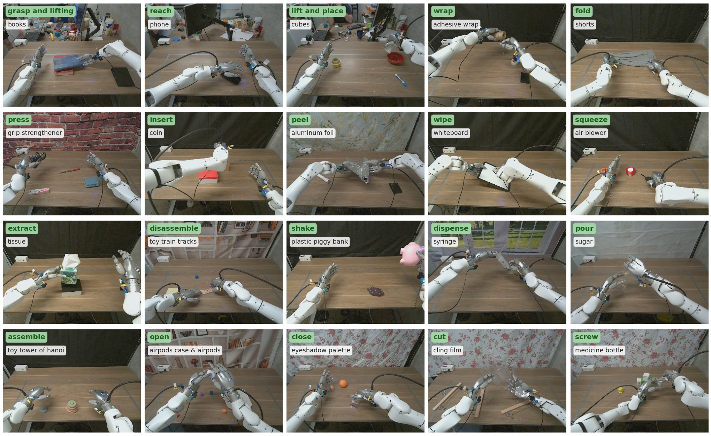
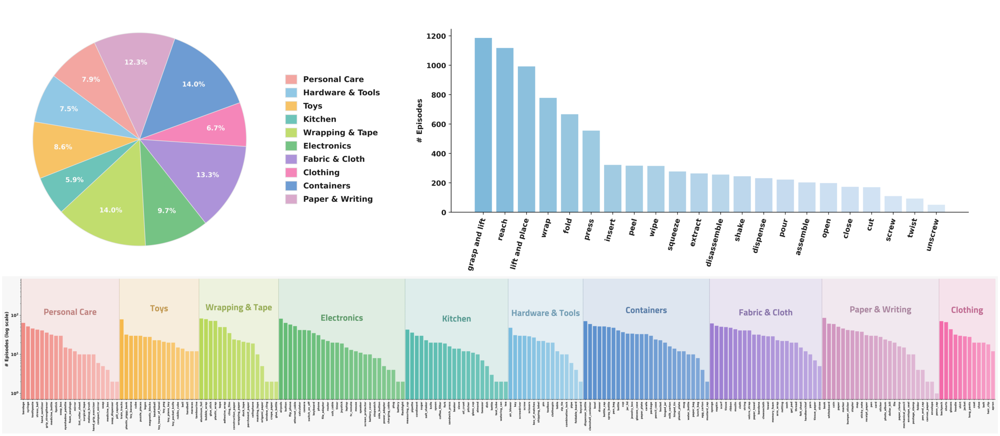

# T-Rex Dataset Quick Start

Browse, inspect, and replay the [**T-Rex Dataset**](https://huggingface.co/datasets/zekaiwang/trex_dataset)
([LeRobotDataset v3.0](https://github.com/huggingface/lerobot)) — stream individual episodes without
downloading the full ~1.4 TB.

<p align="center">
  
  <br>
  <em>One episode from each of 20 motor primitives (head-camera view, cropped to the workspace), each with a different object.</em>
</p>

## Dataset

A large-scale, tactile-reactive **bimanual** manipulation dataset, collected via teleoperation on a
Dexmate Vega-1 robot with two Sharpa Wave dexterous hands: ~50 hours and 5,400+ trajectories
(22 motor primitives, 200+ objects) at 30 fps, released as a
[LeRobotDataset v3.0](https://github.com/huggingface/lerobot).

The full teleoperation/hardware stack used to collect the dataset (with a
diagram of the physical setup) is released in
[`hardware_code/`](../hardware_code/README.md).

The Vega-1's wheels, torso, and head joints stay fixed during collection — only the 14 arm joints
and the two hands are actuated. The head camera is a ZED X Mini (left RGB stream); the wrist
cameras are wide-view ZED X One S; all three record at 640×360. Teleoperation uses Manus gloves
(fingertip positions, retargeted to the hands via the manufacturer's Pinocchio/CasADi differential
IK) and VIVE trackers (SE(3) wrist poses, tracked via differential IK with Pink): a 30 Hz
high-level loop records observations and joint-space targets (the dataset's `action`) while a
300 Hz low-level controller tracks them.

Per-frame features:

| feature | shape | description |
|---|---|---|
| `observation.state` | `(58,)` | joint positions, laid out `[L_arm 7 \| L_hand 22 \| R_arm 7 \| R_hand 22]` |
| `action` | `(58,)` | target joint positions (same layout) |
| `observation.tactile_force` | `(60,)` | per-fingertip 6-axis wrench: `(left, right) × (thumb…pinky) × (Fx, Fy, Fz, Mx, My, Mz)` |
| `observation.images.{head_left, left_wrist, right_wrist}` | `360×640×3` | scene + wrist RGB cameras |
| `observation.images.tactile_{left,right}_raw_{finger}` | `240×320`, gray | raw tactile images (10 = 2 hands × 5 fingers) |
| `observation.images.tactile_{left,right}_deform_{finger}` | `240×240`, gray | tactile deformation fields (10) |

Finger order is `thumb, index, middle, ring, pinky`; arm joints are `L_arm_j1..7` / `R_arm_j1..7`.
See [`schema.py`](src/trex_dataset_quickstart/schema.py) for the full set of dimensions and joint
names.

<p align="center">
  
  <br>
  <em>Dataset composition: object categories, episodes per motor primitive, and per-object episode counts.</em>
</p>

### Tactile video encoding

The raw and deform tactile videos are stored **losslessly** (`libx264 -qp 0`), since their pixel
values are physically meaningful (raw sensor images and deformation maps). They are grayscale — the
signal is carried entirely by the luma (Y) plane — and use **full-range** `yuvj420p`, so values span
the full `0–255` with no range conversion. Decoding the luma plane reproduces the original `uint8`
images exactly (e.g. `frame.to_ndarray(format="gray")` in PyAV).

> **Note.** Because they are lossless, the tactile videos use the H.264 *High 4:4:4 Predictive*
> profile, which most browsers and the Hugging Face web preview cannot decode, so they do not show
> thumbnails on the dataset page. This is expected — decode them locally with ffmpeg, PyAV, or
> torchcodec. The RGB cameras use standard `yuv420p` (limited range, BT.709) and preview normally.

## Install

With [uv](https://docs.astral.sh/uv/):

```bash
uv venv && uv pip install -e .        # core: browse + inspect
uv pip install -e '.[replay]'         # + pinocchio & viser, for 3D replay
uv pip install -e '.[viz]'            # + opencv, for the episode-video tool
```

Or with conda (everything installs through pip inside the env):

```bash
conda create -n trex-quickstart python=3.10 -y
conda activate trex-quickstart
pip install -e .                      # core: browse + inspect
pip install -e '.[replay]'            # + pinocchio & viser, for 3D replay
pip install -e '.[viz]'               # + opencv, for the episode-video tool
```

The `[replay]` extra installs Pinocchio (the `pin` wheels, which also bring `coal` and `eigenpy`)
and viser. Replay additionally uses two robot descriptions, both vendored under `third_party/` (so a
normal `git clone` already includes them):

- **`dexmate_urdf`** (arms) — install from source, following its own
  [README](third_party/dexmate-urdf/README.md):
  ```bash
  uv pip install ruff                 # generate_content.py shells out to ruff
  cd third_party/dexmate-urdf
  cp -r robots/* src/dexmate_urdf/robots/
  python scripts/workflows/generate_content.py
  uv pip install -e .                 # conda: pip install -e .
  ```
  Alternatively, install the published package: `uv pip install dexmate_urdf` (conda: `pip install dexmate_urdf`).
- **Sharpa hand** (`third_party/sharpa-urdf-usd-xml`) — no installation; it is loaded directly from
  file.

## Layout

```
quickstart.ipynb            Colab-friendly notebook: browse + inspect episodes
src/trex_dataset_quickstart/
  schema.py                 feature dimensions + joint names
  hub.py                    metadata browsing + per-episode selective download
  decode.py                 video / state / action / tactile decoding (av + pandas)
  robot.py                  Pinocchio model (arms + hands) + forward kinematics
scripts/
  replay.ipynb              3D replay of one episode in viser
  visualize_episode.ipynb   joint state-vs-target plot + composed mp4 (RGB + tactile + force)
third_party/                vendored robot descriptions (git subtrees) — see third_party/README.md
```

## Replay

The Dexmate arm and Sharpa hand descriptions are vendored under `third_party/` (both Apache-2.0);
see [`third_party/README.md`](third_party/README.md). The dataset stores joints in the order
`[L_arm | L_hand | R_arm | R_hand]`, which differs from the Pinocchio model's joint order — the
`schema.split_state` and `robot.assemble_qpos` helpers handle the mapping.

`robot.py` also contains a Pinocchio based forward kinematics method that is useful for converting joint-space configurations into \(SE(3)\) workspace configurations.

To replay an episode, open [`scripts/replay.ipynb`](scripts/replay.ipynb), set `SOURCE` and
`EPISODE_INDEX`, and run all cells: it downloads only that episode's trajectory (no videos), builds
the model, and animates it in an inline viser viewer.

## Visualize an episode

[`scripts/visualize_episode.ipynb`](scripts/visualize_episode.ipynb) (requires the `[viz]` extra)
renders an episode to a composed mp4 — scene/wrist RGB on top, the five left/right fingertips
(raw, deform, and force) below — alongside a joint state-vs-target plot. Set `SOURCE` and
`EPISODE_INDEX` and run all cells (this downloads the episode's videos).
