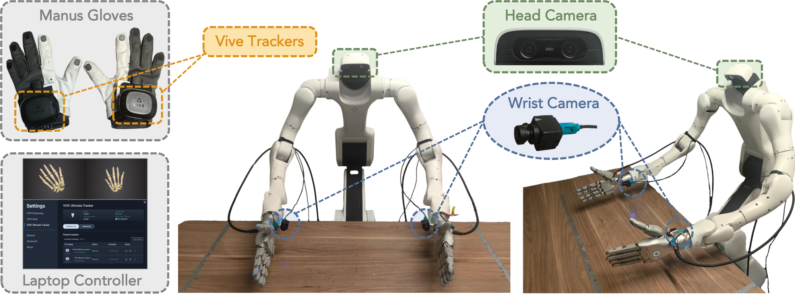

# Hardware Code: SharpaDexmateTeleop

Bimanual teleoperation stack for a [Dexmate Vega](https://dexmate.ai) humanoid
equipped with two [Sharpa Wave](https://www.sharpa.com) dexterous hands — the
system used to collect the T-Rex dataset.

The operator wears Manus MetaGloves Pro (finger tracking, retargeted to the
22-DoF Sharpa hands) and HTC Vive trackers on the wrists (6-DoF arm targets).
The stack solves whole-arm IK with self- and environment-collision avoidance,
streams commands to the robot, and records synchronized episodes — robot and
hand state, fingertip tactile (losslessly compressed), and multi-camera video.

<p align="center">
  
  <br>
  <em>Teleoperation setup: Manus gloves + VIVE trackers drive the bimanual Dexmate Vega-1 with two Sharpa Wave hands; observations come from a head-mounted ZED X Mini camera and two wide-view ZED X One S wrist cameras.</em>
</p>

## Repository layout

| Path | Description |
| --- | --- |
| `teleop/` | Core stack: target source, IK, control loop, data recording, replay |
| `eval/` | Policy inference client for the T-Rex ZMQ inference server (see `eval/README.md`) |
| `camera/` | Camera stream senders (run on robot hardware) and receivers |
| `config/` | Site/deployment configuration (YAML; see `teleop/config.py` for the schema) |
| `third_party/` | Vendored: `dexcontrol`, `dexmate-urdf`, Sharpa Wave hand descriptions; pointers to the Sharpa SDKs |
| `vive_tracker/` | Vive tracker streamer (Windows server + Linux client); vendored subtree |

## System overview

```
 Manus gloves ──▶ glove client ──▶ retargeting publisher ──┐  HandAction (ZMQ/protobuf)
                  (Sharpa Manus SDK, teleop workstation)   │
 Vive trackers ─▶ vive_tracker/server.py ──────────────────┤  wrist poses (ZMQ)
                  (Windows PC — Vive SDK is Windows-only)  │
 head camera ──▶ camera/stream_sender_dexmate.py ──────────┤  frames (ZMQ)
                  (robot Jetson)                           │
 wrist cameras ─▶ camera/stream_sender_zed_box.py ─────────┤
                  (ZED box)                                ▼
                                            teleop/main_teleop.py (workstation)
                                            TeleopTargetSource ─▶ IK + smoothing/safety
                                              ─▶ arms (dexcontrol) + hands (Wave SDK)
                                              ─▶ episode recording (h5 + mp4 + mkv)
```

Everything on the workstation runs inside `main_teleop.py`
(`TeleopTargetSource` consumes the Vive and retargeting streams in-process);
the remaining processes are device-side streamers.

## Installation

Tested on Ubuntu with Python 3.10. Clone the repo, then set up a Python
environment with either **uv** (recommended) or **conda**:

**uv**

```bash
cd hardware_code
uv venv --python 3.10
source .venv/bin/activate
uv pip install -r requirements.txt
uv pip install -e third_party/dexmate-urdf -e third_party/dexcontrol
```

**conda**

```bash
cd hardware_code
conda create -n sharpa-dexmate python=3.10
conda activate sharpa-dexmate
pip install -r requirements.txt
pip install -e third_party/dexmate-urdf -e third_party/dexcontrol
```

(`setup.sh` and `teleop_launcher.sh` auto-detect a `.venv` at the repo root
and fall back to the conda env named by `CONDA_ENV_NAME`.)

Then install the Sharpa SDKs (see `third_party/README.md` for details):

1. **Sharpa Wave SDK** (hand control; provides the `sharpa` Python module):
   download from <https://github.com/sharpa-robotics/sharpa-wave-sdk> and
   install per its README. `setup.sh` adds `/opt/sharpa-wave-sdk/python` to
   `PYTHONPATH` automatically if present.
2. **Sharpa Manus SDK** (glove client + retargeting):

   ```bash
   git clone https://github.com/sharpa-robotics/sharpa-manus-sdk.git third_party/sharpa-manus-sdk
   ```

   Build the glove client and set up the retargeting environment per its user
   manual.

Device-side requirements (one-time, on the respective machines):

- **Windows PC**: Vive Hub + SteamVR + `vive_tracker/` — full walkthrough in
  `vive_tracker/README.md`.
- **Robot Jetson / ZED box**: ZED SDK (`pyzed`) + the matching sender script
  from `camera/` — see `camera/README.md`.
- An `ffmpeg` binary on the workstation (episode video encoding).

## Configuration

All site/deployment-specific settings live in `config/default.yaml`: network
endpoints (Vive server, retargeting publisher, camera senders), hand serial
numbers, default joint poses, control rates, collision environment, data
directory, and tactile video codec. Copy it per site and pass it to the main
entry point; a few common flags (`--data-dir`, `--table-height`) override the
config. The schema is the dataclass tree in `teleop/config.py`, which rejects
unknown keys.

`setup.sh` (source it in every workstation terminal) activates the Python
environment, sets `ROBOT_NAME`/`ROBOT_IP` for `dexcontrol` (edit to match
your robot), and frees the tactile UDP ports.

### Arm PID gains (one-time robot setup)

For both teleoperation and policy inference we consistently run the arms with
PID P-gain multipliers of **1.3 on all 2×7 joints** (firmware factory default
is 1.0). The setting is applied robot-side via the dexcontrol example script
and persists until changed:

```bash
python third_party/dexcontrol/examples/advanced_examples/config_arm_pid.py set \
    --side both --p-multipliers 1.3 1.3 1.3 1.3 1.3 1.3 1.3
# verify:
python third_party/dexcontrol/examples/advanced_examples/config_arm_pid.py get
```

If you observe different tracking stiffness than the recorded data, check
this first.

## Running teleop

Five processes on four machines. Start them in this order:

**1. Vive server — Windows PC**

Prerequisites (one-time): pair the trackers in Vive Hub and configure SteamVR
to run without a headset — full walkthrough and troubleshooting in
`vive_tracker/README.md`. Then start the server with an explicit
tracker-name → serial mapping:

```powershell
cd vive_tracker
python server.py --vive-names left_tracker right_tracker --vive-serials <LEFT_SN> <RIGHT_SN> --bind 0.0.0.0
```

- The names are arbitrary labels but must match
  `vive.left_tracker_name`/`vive.right_tracker_name` in `config/default.yaml`
  (`left_tracker`/`right_tracker` by default), with `left`/`right` referring
  to the operator's wrists.
- **Finding the serials**: the server prints every connected tracker during
  discovery (`Found tracker #1: index=1, serial=58-A33400239`). If you don't
  know which serial is on which wrist yet, start the server with placeholder
  serials, read the printed list (the run will then exit complaining about
  the unknown serial), and restart with the real ones. Physically identify
  left vs right by waking/moving one tracker at a time in
  `python test_live_client.py --vive-names ...`.
- Verify from the workstation before going further:
  `python vive_tracker/client.py --ip <windows pc ip> --vive-names left_tracker right_tracker`
  should print 4×4 wrist poses.

**2. Head camera sender — robot Jetson**

```bash
python stream_sender_dexmate.py
```

**3. Wrist camera sender — ZED box**

```bash
python stream_sender_zed_box.py
```

**4. Manus glove client + retargeting publisher — workstation, two terminals**

```bash
# Terminal A (glove client; operator wears the gloves)
cd third_party/sharpa-manus-sdk/client && sudo ./SharpaManusClient.out

# Terminal B (retargeting: glove keypoints -> Sharpa hand joints over ZMQ)
cd third_party/sharpa-manus-sdk/retargeting_alg_release_* && python retargeting_manus_demo_multiprocess.py
```

**5. Main teleop — workstation**

```bash
source setup.sh
cd teleop
python main_teleop.py --config ../config/default.yaml --data-dir <output dir>
```

`main_teleop.py` connects to the robot and hands, moves the robot to its
default pose, then runs an episode loop driven by prompts:

1. *"Press [Enter] to reset robot to initial pose"* — the robot plans a
   collision-free move back to the default pose.
2. *"Press [Enter] to save robot to initial pose"* — stand in your start
   pose with both wrist trackers tracking: the Vive-to-robot alignment is
   captured at this moment (re-captured every episode).
3. *"Press [Enter] to start recording new episode"* — teleoperation and
   recording run. Hotkeys during the episode: **Enter** stops the episode,
   **a** toggles freezing the right-hand fingers (the arm keeps tracking).
4. After stopping, mark the episode **S**uccess / **F**ailure; files are
   moved into `success/` or `failure/` accordingly, and you may switch the
   data directory for the next episode.

If the Vive or retargeting stream drops out mid-episode for longer than the
configured grace period, teleop stops immediately as a safety measure.

### One-command launcher (optional)

`./teleop_launcher.sh` opens one terminal tab per process above (ssh tabs for
the device-side senders) with relaunch-on-crash convenience. It is provided
as a reference — the manual procedure above is the canonical way to run the
stack, and is easier to debug when something misbehaves.

## Utilities

- `teleop/mock_teleop.py` — viser-only visualization, no robot needed
- `teleop/replay_h5.py` — replay a recorded episode through the control stack
- `teleop/visualize_data.py` — inspect a recorded episode (video + tactile)
- `teleop/reset_arm_to_init_pose.py` — move arms back to the default pose
- `python teleop/robot_descriptions.py` — visualize the combined robot model
- `python teleop/teleop_targets.py` — print retargeted targets without a robot
  (debugs the Vive + glove pipeline end-to-end)

## Policy inference

`eval/eval_trex_async.py` deploys a trained policy on the robot against the
T-Rex ZMQ inference server (slow/fast tactile-refinement protocol; the model
runs on a separate GPU machine). See `eval/README.md`.

## Data format

Each episode directory contains:

- `episode_NNNN.h5` — arm/hand joint positions and targets, end-effector
  poses, Vive poses, F6 tactile vectors, timestamps, and metadata attributes.
- `episode_NNNN_{head_left_rgb,left_wrist,right_wrist}.mp4` — camera streams.
- `episode_NNNN_{left,right}_hand_tactile_{deform,raw}.mkv` — **losslessly**
  compressed grayscale videos of the fingertip tactile maps (libx264 `-qp 0`
  by default, or FFV1; both bit-exact). Each frame tiles the 5 fingers
  horizontally (thumb→pinky); video frame `k` corresponds to HDF5 row `k`.

See `teleop/data_writer.py` for the exact schema and
`teleop/visualize_data.py` for a reader (it decodes the tactile videos back
to `(T, 5, H, W)` arrays).

## Licenses

- The packages vendored under `third_party/` carry their own licenses (see
  the `LICENSE` files in each directory; note `dexcontrol` is AGPL-3.0).
- The Sharpa Wave SDK and Sharpa Manus SDK are distributed by Sharpa Robotics
  under their own terms and are not part of this repository.
