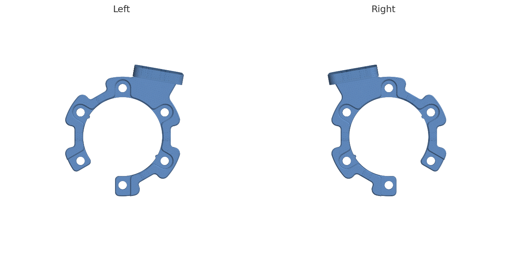

# Wrist mount

3D-printed / CNC adapter that clamps each **Sharpa Wave** hand onto the
**Dexmate Vega-1** arm flange and holds the wide-view ZED X One S wrist camera —
the mount used to collect the T-Rex dataset.

- **`sharpa_dexmate_wrist_mount_right.step`** — right-hand mount.
- **`sharpa_dexmate_wrist_mount_left.step`** — left-hand mount.
